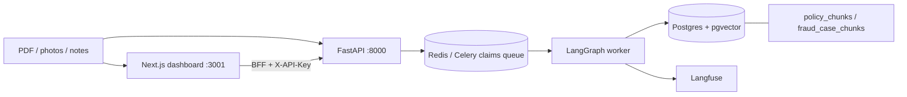
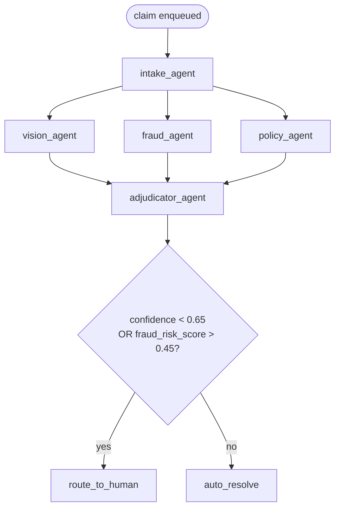

# ClaimGuard

Multi-agent insurance **claims triage** and **fraud detection** — a portfolio
system built like a production service, not a notebook demo.

A claim submission (PDF forms, damage photos, adjuster notes) is ingested
asynchronously and scored by a LangGraph of specialized agents. The system
returns a structured verdict: severity, fraud risk with justification, missing
documents, policy coverage with cited clauses, and a draft settlement memo.
Low-confidence or high-fraud-risk claims go to a human review queue instead of
auto-resolving.

> **Data policy:** every claim, photo, and policy excerpt in this repo is
> synthetic or public/anonymized. There is no real PII and no real customer data.

**15-minute bar:** a stranger can clone, `uv sync --extra dev`, run pytest, and
run the eval CLI. That path does **not** need Docker or an API key. The numbers
in this README are the harness output in [`eval_runs/v0.json`](eval_runs/v0.json).

## Architecture



Serving is async on purpose: a five-agent claim run is not a 200ms HTTP handler.
`POST /v1/claims` returns 202; the worker writes the verdict and a per-agent
trace. Hybrid retrieval (BM25 + dense + RRF) reads the same Postgres instance
that stores claims.

### LangGraph flow



Specialists run in parallel after intake. `trace` uses `operator.add` so parallel
nodes cannot clobber each other. Missing verdict or a node `error` fails closed
to human review.

Fraud combines deterministic rules (NOAA weather fixture, photo EXIF vs loss
date, shared phone / email / VIN) with hybrid RAG over a rewritten fraud-pattern
corpus. Policy drops any cited clause whose id was not in the retrieved set
(`filter_grounded_clauses`) — that is the groundedness jump in the table below.

## Quickstart (under 15 minutes, no Docker)

**Requirements:** [uv](https://docs.astral.sh/uv/), Python 3.12. Docker is only
for the optional full stack later.

```bash
git clone https://github.com/Abhishek842000/claimguard.git
cd claimguard
uv sync --extra dev
uv run pytest
uv run claimguard-eval --dataset v0 --out eval_runs
```

`pytest` is 80+ unit tests (mocked LLM calls). The eval CLI prints the same
before/after table as **Eval results** and overwrites [`eval_runs/v0.md`](eval_runs/v0.md).
Prompts live in `claimguard/llm/prompts/` with version headers; agents do not
inline templates.

### Optional: full local stack (dashboard + Langfuse)

**Requirements:** Docker Desktop. Host Postgres is published on **5434** so it
does not collide with a local 5432.

```bash
cp .env.example .env
docker compose up --build
curl -s http://localhost:8000/health

# first-time corpora (needs the Compose Postgres)
uv run alembic upgrade head
uv run python scripts/ingest_corpora.py

# dashboard (Langfuse keeps port 3000)
cd apps/frontend && npm install && npm run dev
```

If Compose `api`/`worker` images are stale, stop them and run local processes:

```bash
docker compose stop api worker
uv run uvicorn apps.api.main:app --host 127.0.0.1 --port 8000
uv run celery -A apps.worker.celery_app:celery_app worker -Q claims -l info
```

`/v1` routes require header `X-API-Key` (default `claimguard-local`). The Next.js
app proxies through `/api/claimguard/*` so the key is not in client JS.

### Demo

1. Open http://localhost:3001
2. Pick `PA-2026-000039 · hail`, or upload a PDF / photos + notes (each file-picker
   open **appends**; submit once). For camera photos use the Phoenix FNOL at
   `data/synthetic_claims/09d919dc-2168-544f-8ec0-4a0f018c8ef6/documents/fnol-claim-form.pdf`
   — a Denver form will not fire the weather-mismatch demo.
3. Watch status move to `needs_review` or `auto_resolved`
4. Open the claim: verdict + a step-by-step agent timeline (not a JSON dump)
5. Cost panel on the home page shows running total, avg/claim, and by-agent spend

**Walkthrough video:** [`docs/demo/claimguard-demo.mp4`](docs/demo/claimguard-demo.mp4)
(~29s, 1280×720). It submits sample `PA-2026-000039 · hail`, then scrolls the
verdict and agent timeline. The live path below is the same flow.

| Service             | URL                            | Notes                                      |
|---------------------|--------------------------------|--------------------------------------------|
| API                 | http://localhost:8000          | OpenAPI at `/docs`                         |
| API health          | http://localhost:8000/health   | 200 only if Postgres + Redis are up        |
| ClaimGuard Postgres | localhost:5434                 | Host 5434 → container 5432                 |
| Redis               | localhost:6379                 | Celery uses logical DB 1                   |
| Langfuse            | http://localhost:3000          | `dev@claimguard.local` / `claimguarddev`   |
| Dashboard           | http://localhost:3001          | Submit, claims list, visual agent timeline |
| Metrics             | http://localhost:8000/v1/metrics | Requires `X-API-Key`                     |

Deploy (Fly.io API + worker, Fly Postgres + pgvector, Upstash Redis, Langfuse
Cloud Hobby): **[docs/DEPLOY.md](docs/DEPLOY.md)**.

## Eval results

Holdout `v0`: **18 cases** (4 fraud / 14 legit). No id overlap with
`data/synthetic_claims/`. Command: `uv run claimguard-eval --dataset v0 --out eval_runs`.

| Metric | Baseline | ClaimGuard |
|--------|----------|------------|
| Fraud precision | 0.3333 | 1.0 |
| Fraud recall | 0.5 | 0.5 |
| Retrieval groundedness | 0.0 | 1.0 |
| Hallucination rate | 1.0 | 0.0 |
| Latency p50 / p95 (ms) | 13.7 / 17.0 | 13.7 / 17.0 |
| Cost per claim (USD) | 0.001347 | 0.001347 |

Confusion counts (ClaimGuard): **2 TP / 0 FP / 2 FN / 14 TN**. Baseline fraud =
claimed amount > $7500 (2 TP / 4 FP). Baseline groundedness = treat a planted
`pap-invented-99` clause as accepted. ClaimGuard fraud = `fraud_risk_score > 0.45`
after rules + RAG. Groundedness = every cited clause id ⊆ retrieved ids.

Latency and cost are the **offline heuristic** path (no live LLM). That is
intentional: the harness is reproducible without an API key. Live OpenAI calls
would raise both numbers; do not quote 13.7 ms as production model latency.

The two false negatives are a mileage-inconsistency fire claim (no mileage rule
yet) and a duplicate-VIN collision that did not clear the 0.45 gate. Precision
moved; recall did not. See [RESUME_BULLETS.md](RESUME_BULLETS.md).

## Tech stack

| Layer            | Choice                                                                 |
|------------------|------------------------------------------------------------------------|
| Orchestration    | LangGraph StateGraph (conditional routing, not a chain)                |
| Retrieval        | BM25 + pgvector dense + RRF (identity reranker; protocol for a CE)     |
| Serving          | FastAPI + Celery + Redis                                               |
| Persistence      | Postgres 16 + pgvector, Alembic migrations                             |
| Observability    | Langfuse (Compose locally, Cloud Hobby in deploy), PII redaction, cost |
| Schemas          | Pydantic v2, `extra="forbid"`, at every agent boundary                 |
| Eval             | Versioned labeled set, deterministic metrics + `judge_v1`              |
| Frontend         | Next.js 15 (agent-trace dashboard, clean enough to demo)               |
| Packaging        | uv, Docker Compose, Fly process groups                                 |

### Why these choices (the interview version)

**pgvector over Pinecone.** Claims, traces, and chunks already live in Postgres.
At this corpus size (~46 policy + 16 fraud chunks, 768-d `bge-base-en-v1.5`)
HNSW inside the same database is enough, one backup story, no second vendor
bill, and Alembic owns the schema. Pinecone would win at much larger, write-heavy
ANN — not at 60 chunks. The retriever is behind a protocol; the index can move.

**Langfuse self-hosted locally, Cloud Hobby in deploy.** Compose Langfuse v3
needs ClickHouse + MinIO + its own Postgres. That is the right shape for
keeping traces on a laptop next to PII redaction. Replicating it on Fly is
four extra machines for a demo. Cloud Hobby is the deploy default; the SDK
path is the same (`LANGFUSE_HOST` + keys). Failures never fail a claim.

**Model routing.** `CHEAP_MODEL` (gpt-4o-mini) is the default for intake /
fraud / policy structured extraction. `FRONTIER_MODEL` (gpt-4o) is reserved
for the adjudicator memo. Offline, `HeuristicIntakeCompleter` and sibling
completers keep pytest + `claimguard-eval` deterministic. That split is the
cost story: spend frontier tokens only on the write-up a human will read.

## What I'd do with more time

- Fine-tune a fraud classifier on a larger labeled book (the 2 FN cases are
  mileage inconsistency and a duplicate VIN that scored 0.34 — rules do not
  cover every injected signal yet).
- Close the loop: human-review corrections become new rows in `data/eval_set`
  so the harness grows from production mistakes instead of only from synthetic
  seeds.
- Cross-encoder rerank (the `Reranker` protocol is already the swap-in) and a
  real HF vision checkpoint instead of the filename heuristic.
- Stronger entity graph (same phone + different named insured, VIN parse
  robustness) and a mileage-vs-prior-odometer rule.
- JWT / per-adjuster keys and a Compose service for the Next.js app.

## Why this project

I am a mid-level software engineer moving into AI engineering. Hiring managers
in that lane care as much about **contracts, tests, eval, and operations** as
they do about calling an LLM.

ClaimGuard is designed so a senior engineer can review it like a PR:

- typed boundaries instead of free-text handoffs
- hybrid retrieval instead of "embed it and hope"
- an eval harness that produces numbers you can regress against
- async workers, because a multi-agent claim run is not a 200ms HTTP handler
- no raw PII in logs — everything goes through `pii_redaction.py` first
- no real customer data, ever

See [PROGRESS.md](PROGRESS.md) for the phase-by-phase build log and
[RESUME_BULLETS.md](RESUME_BULLETS.md) for interview-ready metrics.
